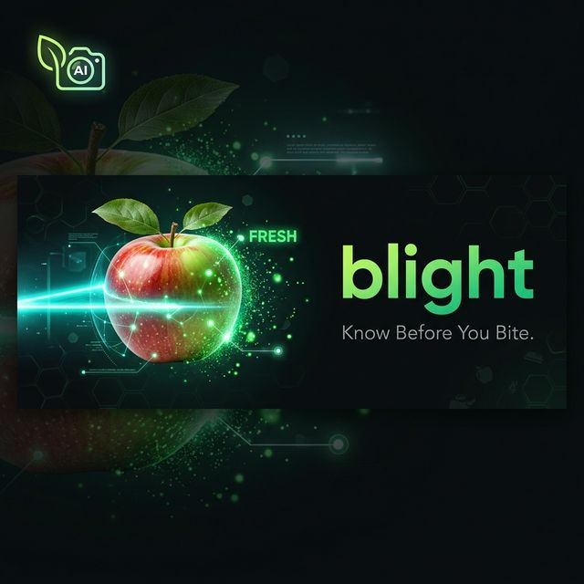
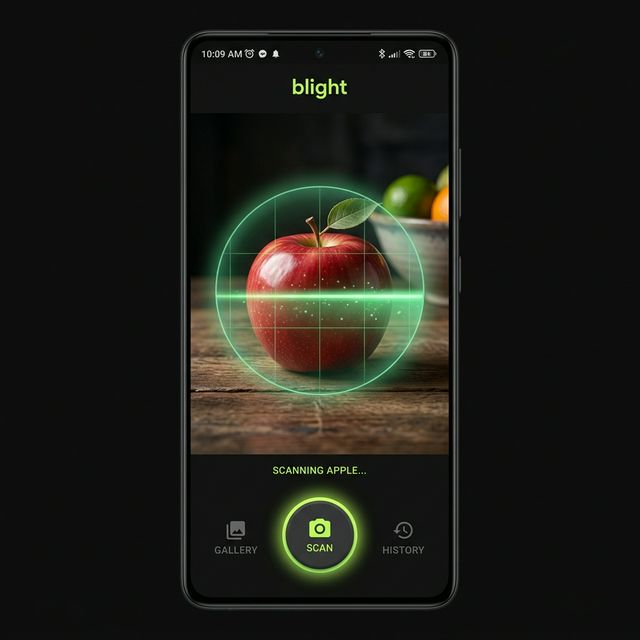
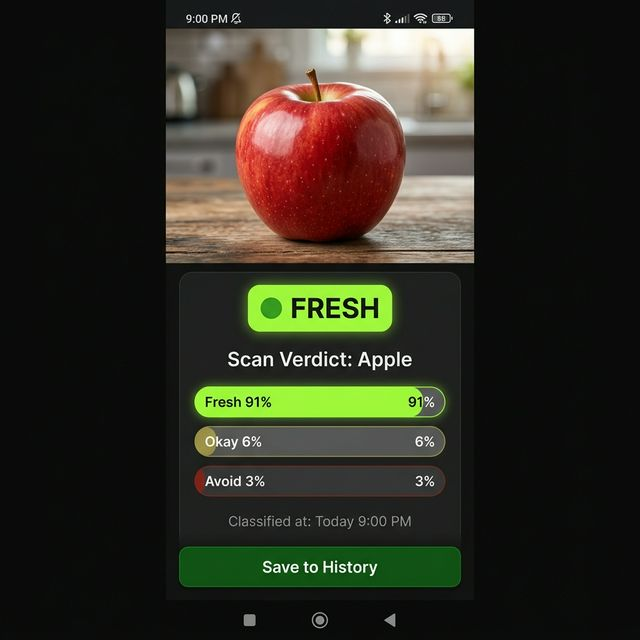

<p align="center">
  
</p>

<h1 align="center">blight</h1>
<p align="center"><em>Know Before You Bite.</em></p>

<p align="center">
  
  
  
  
  
</p>

---

**blight** is a cross-platform Flutter app that tells you whether your food is **fresh**, **okay**, or should be **avoided** — instantly, on-device, with zero cloud dependency for the main scan path.

Point your camera at any food item. Blight's on-device TFLite model analyses it in milliseconds. If it isn't sure (confidence < 60%), it silently escalates to a HuggingFace cloud model. You always get a confident answer.

---

## 📸 Screenshots

<p align="center">
  
  &nbsp;&nbsp;&nbsp;&nbsp;
  
</p>
<p align="center">
  <sub>Scan Screen &nbsp;&nbsp;&nbsp;&nbsp;&nbsp;&nbsp;&nbsp;&nbsp;&nbsp;&nbsp;&nbsp;&nbsp;&nbsp;&nbsp;&nbsp;&nbsp;&nbsp;&nbsp;&nbsp;&nbsp;&nbsp;&nbsp;&nbsp;&nbsp;&nbsp;&nbsp;&nbsp;&nbsp;&nbsp;&nbsp;&nbsp;&nbsp;&nbsp;&nbsp;&nbsp;&nbsp; Result Screen</sub>
</p>

---

## ✨ Features

| Feature | Detail |
|---|---|
| 🔬 **On-device ML** | TFLite inference — no internet required for most scans |
| ☁️ **Cloud fallback** | HuggingFace `nateraw/food` escalation when confidence < 60% |
| 📊 **Confidence bars** | Fresh / Okay / Avoid scores shown per scan |
| 📜 **Scan history** | Drift ORM — full local SQLite history with timestamps |
| 🔔 **Expiry reminders** | Background WorkManager + local notifications |
| 🔐 **Secure settings** | `flutter_secure_storage` — cloud preference persisted safely |
| 🎨 **Dark UI** | Material 3, custom dark theme, animated scan button |

---

## 🏗️ Architecture

```
lib/
├── core/
│   ├── di/            → GetIt + injectable dependency injection
│   ├── error/         → Failures & Exceptions (sealed classes)
│   ├── network/       → NetworkInfo (connectivity_plus)
│   ├── router/        → go_router app routing
│   ├── theme/         → AppColors, AppTheme (Material 3)
│   └── utils/         → image_utils (preprocess, normalize, center-crop)
│
└── features/
    ├── classify/
    │   ├── data/
    │   │   ├── datasources/   → TFLiteClassifier, CloudClassifyService
    │   │   ├── models/        → FreshnessResultModel, HuggingFaceResponse
    │   │   └── repositories/  → ClassifyRepositoryImpl (routing logic)
    │   ├── domain/
    │   │   ├── entities/      → FreshnessResult, FreshnessVerdict
    │   │   ├── repositories/  → ClassifyRepository (abstract)
    │   │   └── usecases/      → ClassifyFoodUseCase
    │   └── presentation/
    │       ├── bloc/          → ClassifyBloc (events/states via freezed)
    │       ├── pages/         → CameraPage, ResultPage
    │       └── widgets/       → VerdictCard, ConfidenceBars, AnimatedScanButton
    ├── history/               → Drift DB, HistoryBloc, HistoryPage
    └── settings/              → SettingsCubit, BackgroundWorker, NotificationService
```

**Classification flow:**

```
CameraPage
  └─ ClassifyBloc.ClassifyRequested
       └─ ClassifyFoodUseCase
            └─ ClassifyRepositoryImpl
                 ├─ [if use_cloud_ai=true OR tflite unavailable] → CloudClassifyService (HuggingFace)
                 ├─ [if confidence ≥ 60%]                        → Return local TFLite result
                 └─ [if confidence < 60% AND connected]          → Escalate to CloudClassifyService
```

---

## 🚀 Getting Started

### Prerequisites
- Flutter 3.10+ / Dart 3.0+
- Android SDK 21+ or iOS 13+

### Setup

```bash
# 1. Install dependencies
flutter pub get

# 2. Generate code (freezed, drift, injectable)
dart run build_runner build --delete-conflicting-outputs

# 3. Run the app
flutter run
```

> **Note:** A pre-built `freshlens.tflite` model is already bundled in `assets/models/`. No additional model download required.

---

## 🧪 Test Suite

30 unit tests covering the entire AI pipeline:

```bash
flutter test --reporter=expanded
```

| File | Tests | Covers |
|---|---|---|
| `image_utils_test.dart` | 8 | Pixel normalization, buffer size, center-crop |
| `freshness_result_test.dart` | 4 | Confidence getter, enum completeness |
| `classify_repository_impl_test.dart` | 12 | Routing, escalation, verdict mapping, cloud safety |
| `classify_bloc_test.dart` | 6 | BLoC state machine transitions |

---

## 🛠️ Tech Stack

| Layer | Technology |
|---|---|
| **UI** | Flutter 3.x, Material 3 |
| **State** | flutter_bloc (BLoC + Cubit), freezed |
| **Navigation** | go_router |
| **ML (local)** | tflite_flutter 0.12.x |
| **ML (cloud)** | Dio → HuggingFace Inference API |
| **Database** | Drift ORM (SQLite) |
| **DI** | get_it + injectable |
| **Notifications** | flutter_local_notifications + WorkManager |
| **Image processing** | image package (bakeOrientation, center-crop, normalize) |
| **Testing** | flutter_test, bloc_test, mocktail |

---

## 📄 License

Licensed under the [Apache License 2.0](LICENSE).
